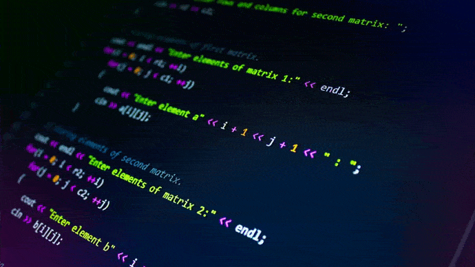

### Hola! Soy brian 👋


&nbsp;&nbsp;

<h2 align="center">
🚀 Lenguajes y herramientas
</h2>


&nbsp;&nbsp;

<h2 align="center">
✈ Sobre mi
</h2>

```js
const aboutMe = {
    description: "Hola! Soy Brian, desarrollador Full Stack, actualmente estoy en busqueda de nuevos desafios y experiencias que me permitan explotar mi conocimientos y adquirir nuevos."
    otherTech: {
        inProgres: true,
        technologies: ["React-Native", "Typescript", "Firebase"]
    },
    contact: {
      LinkedIn: "brian-santaran-dev",
      GitHub: "briancalamar",
      email: "briansantarandev@gmail.com",
    }
}
```
&nbsp;&nbsp;

## 🐕 Dogs app
<p>
  <a></a>
  <a></a>
  <a></a>
</p>

